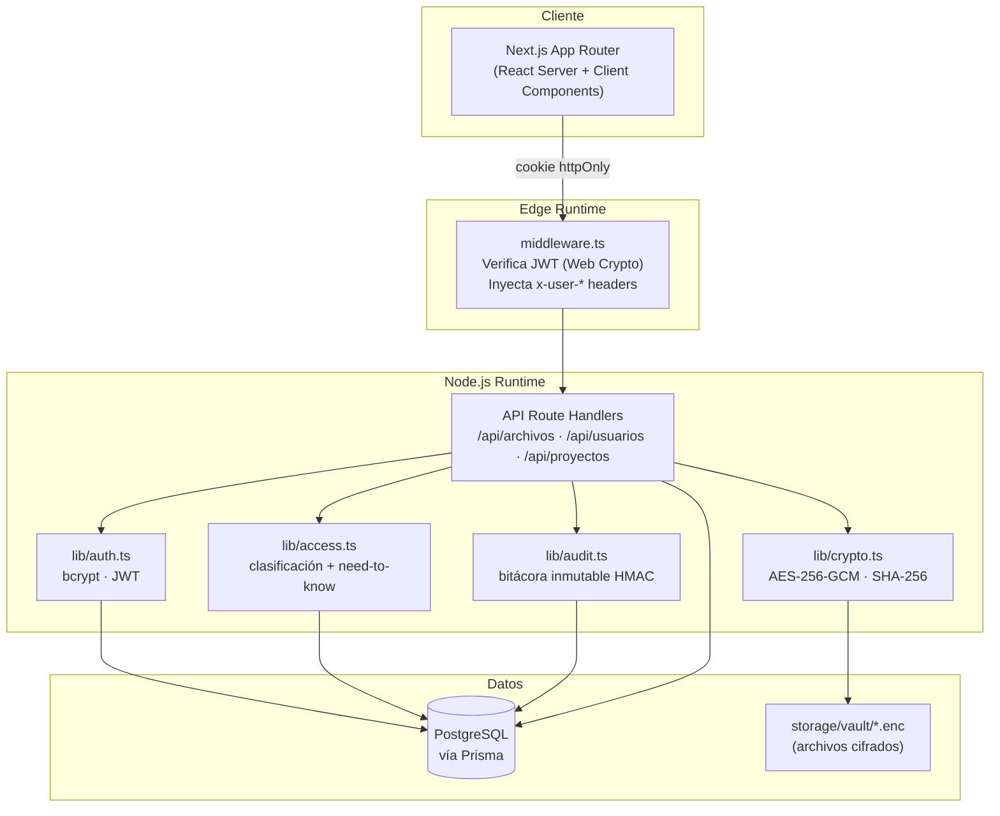
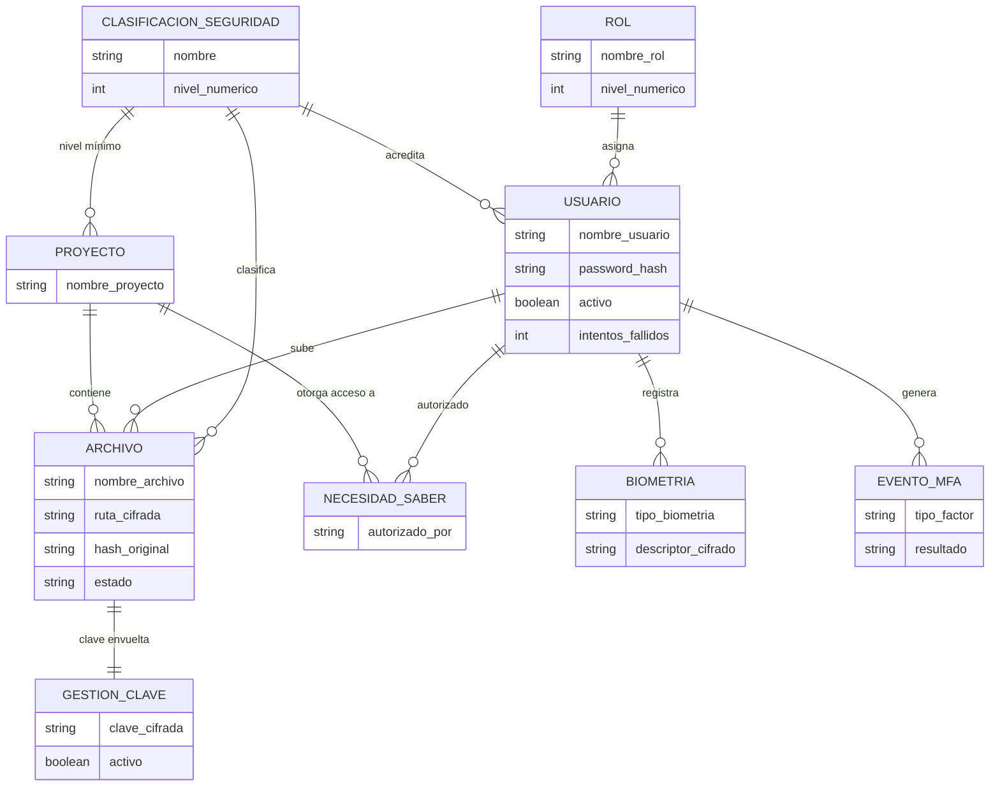

# 🔐 OSLU — Sistema de Bóveda Segura

[](https://github.com/oslusystem/OSLU-Sistema-de-Boveda-Segura/actions/workflows/ci.yml)

**OSLU** es una bóveda documental para información sensible: cada archivo se
cifra individualmente, cada acceso pasa por tres barreras de seguridad
(usuario activo, clasificación y necesidad de saber) y cada acción —subida,
descarga, login, borrado— queda registrada en una bitácora que no se puede
alterar ni borrar, ni siquiera por un administrador con acceso directo a la
base de datos.

Construido con **Next.js 15** (App Router) y **PostgreSQL** vía **Prisma**.
El login es de dos pasos: contraseña y, obligatoriamente, **reconocimiento
facial** como segundo factor. El cifrado es **AES‑256‑GCM** con clave por
archivo envuelta en una clave maestra del servidor (envelope encryption), y el
control de acceso sigue el modelo **Bell‑LaPadula** ("no leer hacia arriba")
combinado con autorizaciones explícitas por proyecto.

---

## ✨ Características de seguridad

- **Cifrado en reposo** — cada archivo se cifra con su propia clave AES‑256‑GCM;
  esa clave se guarda *envuelta* (envelope encryption) con la `MASTER_KEY` del
  servidor en la tabla `gestion_claves`.
- **Integridad** — se almacena el SHA‑256 del contenido original y se reverifica
  en cada descarga.
- **Control de acceso multicapa** — clasificación (Bell‑LaPadula "no read up") +
  necesidad de saber por compartimento.
- **Bitácora inmutable** — cadena de firmas HMAC‑SHA256 (estilo libro mayor) y
  reglas SQL que bloquean `UPDATE`/`DELETE`.
- **Separación de runtimes** — verificación JWT en el Edge (Web Crypto API) y
  lógica Node.js en los route handlers.

---

## 🏛️ Arquitectura



### 🗄️ Modelo de datos (entidad-relación)



### 🔑 Login en dos pasos (contraseña + MFA facial)

```mermaid
sequenceDiagram
    actor U as Usuario
    participant UI as Next.js (cliente)
    participant L as POST /api/auth/login
    participant M as POST /api/auth/mfa/enroll | verify
    participant DB as PostgreSQL

    U->>UI: usuario + contraseña
    UI->>L: POST credenciales
    L->>DB: buscar usuario + verificar bcrypt
    alt credenciales inválidas
        L-->>UI: 401 (incrementa intentos_fallidos; bloquea al 3°)
    else credenciales válidas
        L->>DB: registrar evento LOGIN (pendiente MFA)
        L-->>UI: 200 + cookie boveda_preauth (JWT scope "mfa", 5 min)
        UI->>U: solicitar captura facial (face-api.js, 128-d)
        alt primer ingreso (sin biometría registrada)
            UI->>M: POST /mfa/enroll (descriptor)
            M->>DB: guardar descriptor cifrado (AES-256-GCM)
        else ingreso posterior
            UI->>M: POST /mfa/verify (descriptor)
            M->>DB: comparar distancia euclidiana (umbral 0.55)
        end
        M->>DB: registrar EventoMFA + emitir sesión (issueSession)
        M-->>UI: 200 + cookie boveda_token (sesión real)
        UI->>U: acceso al dashboard
    end
```

---

## 📸 Capturas del sistema

**Login** — autenticación en dos pasos (contraseña + MFA facial)


**Dashboard** — vista general, estado de la bóveda y accesos rápidos


**Bóveda** — proyectos (compartimentos) y archivos cifrados


**Gestión de usuarios** — roles y niveles de acreditación


**Auditoría** — bitácora inmutable con verificación de integridad de la cadena


**Información** — propósito del sistema y características de seguridad


---

## 🚀 Puesta en marcha

```bash
npm install
cp .env.example .env.local          # completar credenciales reales
npm run db:setup                    # generate + migrate + harden (reglas inmutables) + seed
npm run dev
```

> `db:setup` encadena todo. Equivale a: `prisma generate` →
> `prisma migrate dev` → `npm run db:harden` (aplica `prisma/immutability.sql`)
> → `npm run db:seed`.

Generar las claves de cifrado y firma:

```bash
node -e "console.log('MASTER_KEY=' + require('crypto').randomBytes(32).toString('hex'))"
node -e "console.log('HMAC_SECRET=' + require('crypto').randomBytes(32).toString('hex'))"
```

### Credenciales tras el seed

| Usuario | Contraseña | Rol | Acreditación |
|---|---|---|---|
| `admin` | `Admin1234!` | Administrador | SECRETO |
| `superior` | `Superior1234!` | Oficial Superior | CONFIDENCIAL |
| `general` | `General1234!` | Oficial General | SECRETO |
| `subalterno` | `Subalterno1234!` | Oficial Subalterno | RESERVADO |

---

## 🧪 Comandos

```bash
npm run dev        # servidor de desarrollo (Turbopack)
npm run build      # build de producción
npm run lint       # ESLint
npm test           # pruebas unitarias (Vitest)
npm run test:watch # pruebas en modo watch

npx prisma studio  # explorador visual de la BD
npx prisma migrate dev --name <nombre>   # nueva migración
```

> ⚠️ Tras cada `prisma migrate`, ejecutar `npm run db:harden` para reaplicar las
> reglas de inmutabilidad de la bitácora (`prisma/immutability.sql`, idempotente),
> ya que Prisma no genera reglas `RULE` automáticamente.

---

## 📚 Documentación técnica

El código se documenta a sí mismo con comentarios JSDoc en cada módulo y función
principal de `src/lib`. Para generar el sitio estático navegable a partir de esos
comentarios:

```bash
npm run docs
```

Esto genera `docs-site/index.html` (con [TypeDoc](https://typedoc.org)) — ábrelo
en el navegador para explorar la documentación de `auth`, `crypto`, `access`,
`audit`, `face`, `session`, `utils` y los tipos compartidos. La carpeta
`docs-site/` no se versiona (se regenera bajo demanda, ver `.gitignore`).

---

## 📦 Stack

- **Next.js 15** · App Router · React 19
- **Prisma 5** + **PostgreSQL**
- **bcryptjs** (hash de contraseñas) · **jsonwebtoken** (sesión)
- **Node.js crypto** (AES‑256‑GCM, SHA‑256, HMAC)
- **Tailwind CSS** · **Vitest**

Detalles de arquitectura interna y convenciones de contribución en
[`CONTRIBUTING.md`](CONTRIBUTING.md). Bitácora de cambios en [`CHANGELOG.md`](CHANGELOG.md).
