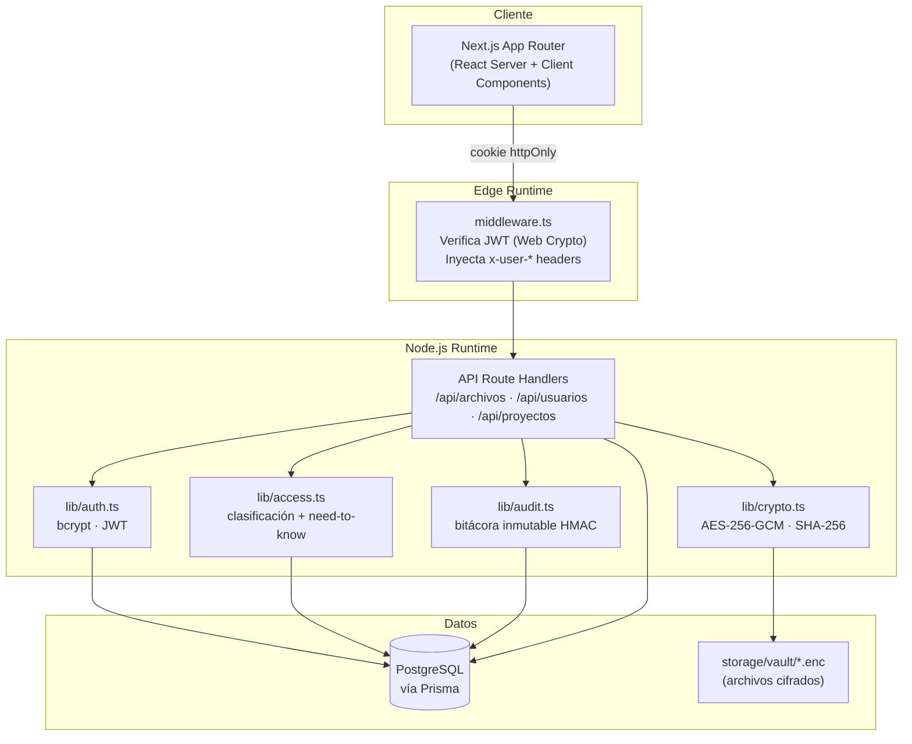
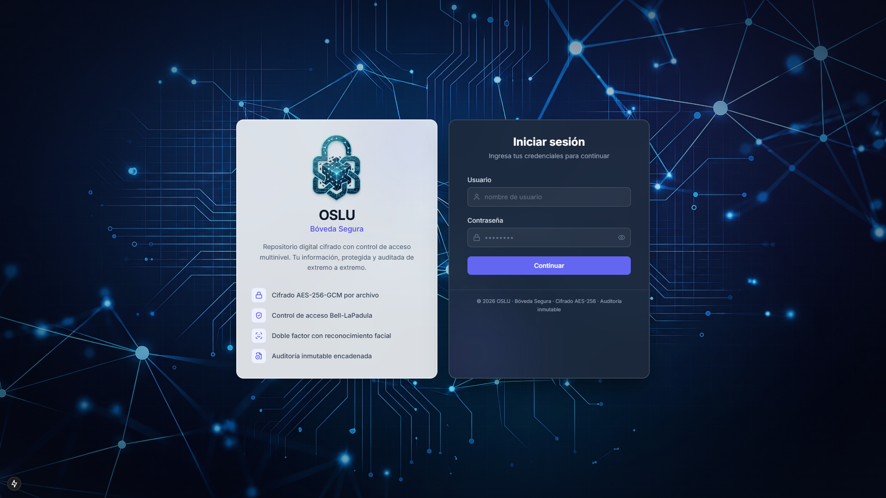
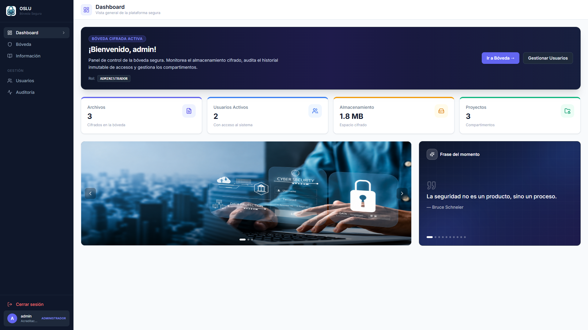
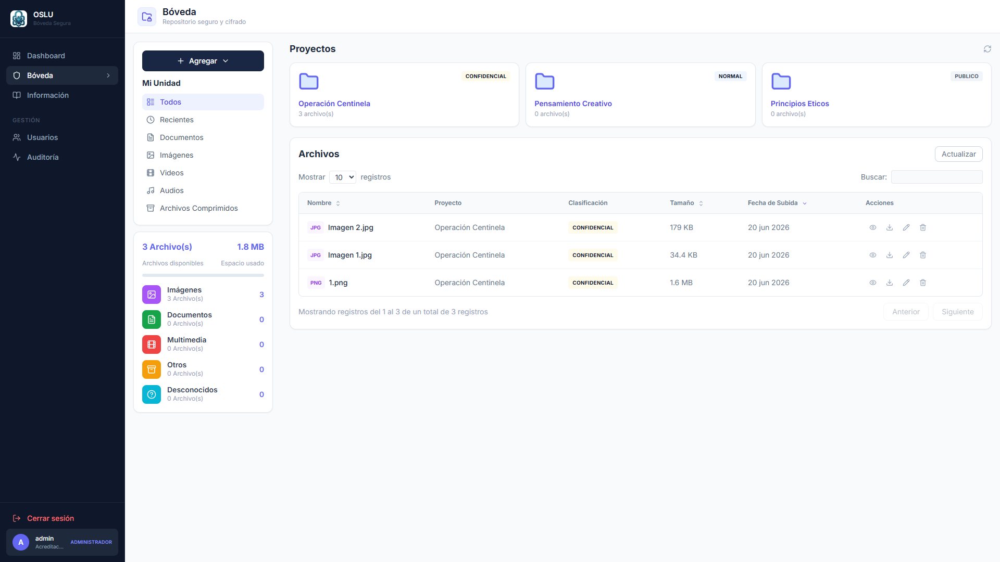
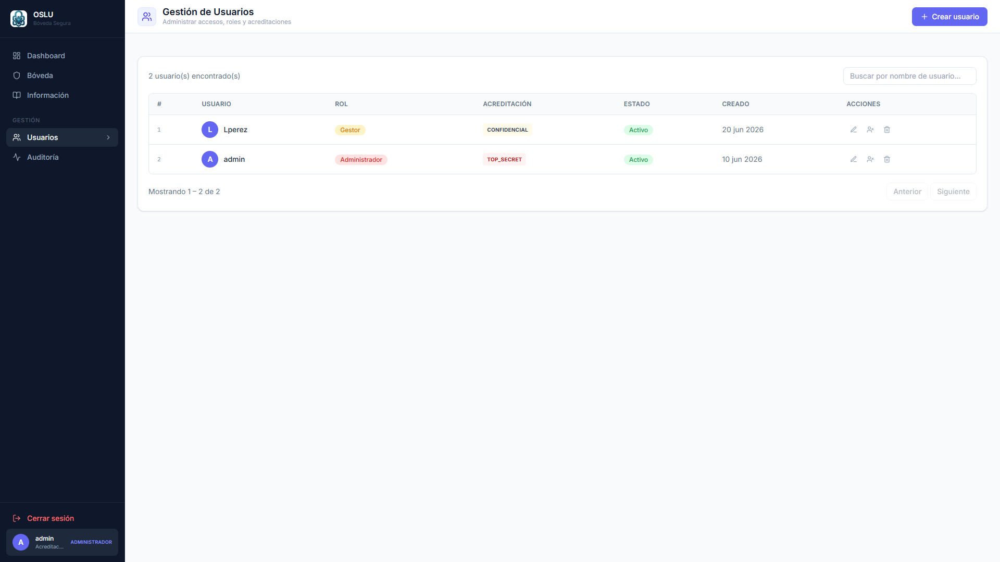
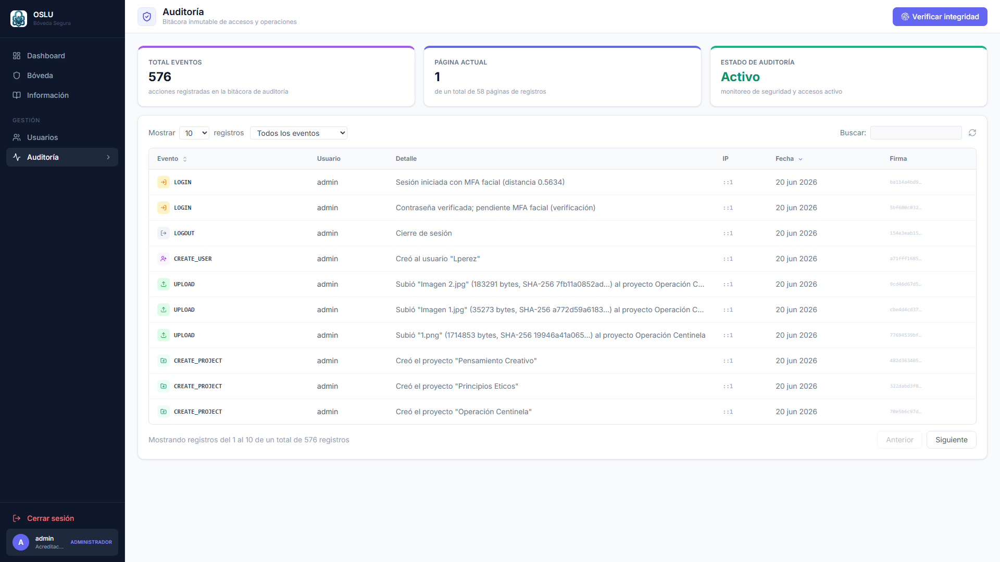
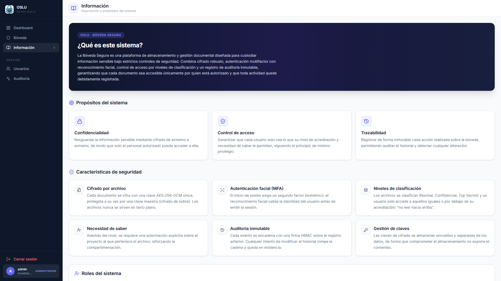

# 🔐 OSLU — Sistema de Bóveda Segura

[](https://github.com/oslusystem/OSLU-Sistema-de-Boveda-Segura/actions/workflows/ci.yml)

**OSLU** es una bóveda documental para información sensible: cada archivo se
cifra individualmente, cada acceso pasa por tres barreras de seguridad
(usuario activo, clasificación y necesidad de saber) y cada acción —subida,
descarga, login, borrado— queda registrada en una bitácora que no se puede
alterar ni borrar, ni siquiera por un administrador con acceso directo a la
base de datos.

Construido con **Next.js 15** (App Router) y **PostgreSQL** vía **Prisma**.
El login es de dos pasos: contraseña y, obligatoriamente, **reconocimiento
facial** como segundo factor. El cifrado es **AES‑256‑GCM** con clave por
archivo envuelta en una clave maestra del servidor (envelope encryption), y el
control de acceso sigue el modelo **Bell‑LaPadula** ("no leer hacia arriba")
combinado con autorizaciones explícitas por proyecto.

---

## ✨ Características de seguridad

- **Cifrado en reposo** — cada archivo se cifra con su propia clave AES‑256‑GCM;
  esa clave se guarda *envuelta* (envelope encryption) con la `MASTER_KEY` del
  servidor en la tabla `gestion_claves`.
- **Integridad** — se almacena el SHA‑256 del contenido original y se reverifica
  en cada descarga.
- **Control de acceso multicapa** — clasificación (Bell‑LaPadula "no read up") +
  necesidad de saber por compartimento.
- **Bitácora inmutable** — cadena de firmas HMAC‑SHA256 (estilo libro mayor) y
  reglas SQL que bloquean `UPDATE`/`DELETE`.
- **Separación de runtimes** — verificación JWT en el Edge (Web Crypto API) y
  lógica Node.js en los route handlers.

---

## 🏛️ Arquitectura



---

## 📸 Capturas del sistema

**Login** — autenticación en dos pasos (contraseña + MFA facial)


**Dashboard** — vista general, estado de la bóveda y accesos rápidos


**Bóveda** — proyectos (compartimentos) y archivos cifrados


**Gestión de usuarios** — roles y niveles de acreditación


**Auditoría** — bitácora inmutable con verificación de integridad de la cadena


**Información** — propósito del sistema y características de seguridad


---

## 🚀 Puesta en marcha

```bash
npm install
cp .env.example .env.local          # completar credenciales reales
npm run db:setup                    # generate + migrate + harden (reglas inmutables) + seed
npm run dev
```

> `db:setup` encadena todo. Equivale a: `prisma generate` →
> `prisma migrate dev` → `npm run db:harden` (aplica `prisma/immutability.sql`)
> → `npm run db:seed`.

Generar las claves de cifrado y firma:

```bash
node -e "console.log('MASTER_KEY=' + require('crypto').randomBytes(32).toString('hex'))"
node -e "console.log('HMAC_SECRET=' + require('crypto').randomBytes(32).toString('hex'))"
```

> ⚠️ Los archivos subidos se guardan en **Netlify Blobs** (`src/lib/storage.ts`),
> no en disco local — incluso en desarrollo hacen falta `NETLIFY_SITE_ID` y
> `NETLIFY_BLOBS_TOKEN` reales (Site details + un Personal Access Token en
> Netlify), o correr con `netlify dev` sobre un sitio ya vinculado
> (`netlify link`), que inyecta el contexto automáticamente.

### Credenciales tras el seed

| Usuario | Contraseña | Rol | Acreditación |
|---|---|---|---|
| `admin` | `Admin1234!` | Administrador | SECRETO |
| `superior` | `Superior1234!` | Oficial Superior | CONFIDENCIAL |
| `general` | `General1234!` | Oficial General | SECRETO |
| `subalterno` | `Subalterno1234!` | Oficial Subalterno | RESERVADO |

---

## 🧪 Comandos

```bash
npm run dev        # servidor de desarrollo (Turbopack)
npm run build      # build de producción
npm run lint       # ESLint
npm test           # pruebas unitarias (Vitest)
npm run test:watch # pruebas en modo watch

npx prisma studio  # explorador visual de la BD
npx prisma migrate dev --name <nombre>   # nueva migración
```

> ⚠️ Tras cada `prisma migrate`, ejecutar `npm run db:harden` para reaplicar las
> reglas de inmutabilidad de la bitácora (`prisma/immutability.sql`, idempotente),
> ya que Prisma no genera reglas `RULE` automáticamente.

---

## 🚀 Despliegue

**Sistema en producción:** https://oslu-sistema-boveda.netlify.app

El sistema corre en producción sobre **Netlify** (build serverless inmutable a
partir del código fuente, runtime de Next.js zero-config) + **Neon**
(PostgreSQL serverless) + **Netlify Blobs** (almacenamiento de los archivos
cifrados, ya que el entorno serverless no tiene disco persistente):

- **Artefacto inmutable**: cada despliegue es un build nuevo e inmutable de
  Netlify a partir del commit exacto de `main`; no hay estado mutable en el
  servidor entre despliegues.
- **`src/lib/storage.ts`** — los blobs `.enc` (ya cifrados con AES-256-GCM por
  `crypto.ts`) se guardan en un store de Netlify Blobs en vez de en disco
  local; `archivos.ruta_cifrada` guarda la *key* del blob en vez de una ruta
  de archivo, sin exponerse nunca al cliente.
- **`prisma/schema.prisma`** — `DATABASE_URL` (conexión *pooled* de Neon, la
  usa la app en runtime) y `DIRECT_URL` (conexión directa, la usan las
  migraciones).
- **Self-healing**: al ser serverless, cada request corre en una función
  aislada — un fallo en una invocación no tumba el servicio ni afecta a otras
  peticiones (no hay un único proceso que "se caiga"). `GET /api/health`
  sigue existiendo como endpoint de diagnóstico (verifica conexión a BD) para
  monitoreo externo y como primera parada del `RUNBOOK.md` (Avance #6).
- **Cero credenciales en el repo**: las variables de `.env.example` se
  inyectan como variables de entorno directamente en Netlify (nunca se sube
  un `.env` real).
- **CD automatizado**: `.github/workflows/ci.yml` tiene un job `deploy` que
  se dispara únicamente cuando un Pull Request se fusiona a `main` (con CI en
  verde) — aplica las migraciones contra Neon y publica el build en Netlify
  sin pasos manuales.

---

## 📚 Documentación técnica

El código se documenta a sí mismo con comentarios JSDoc en cada módulo y función
principal de `src/lib`. Para generar el sitio estático navegable a partir de esos
comentarios:

```bash
npm run docs
```

Esto genera `docs-site/index.html` (con [TypeDoc](https://typedoc.org)) — ábrelo
en el navegador para explorar la documentación de `auth`, `crypto`, `access`,
`audit`, `face`, `session`, `utils` y los tipos compartidos. La carpeta
`docs-site/` no se versiona (se regenera bajo demanda, ver `.gitignore`).

---

## 📦 Stack

- **Next.js 15** · App Router · React 19
- **Prisma 5** + **PostgreSQL**
- **bcryptjs** (hash de contraseñas) · **jsonwebtoken** (sesión)
- **Node.js crypto** (AES‑256‑GCM, SHA‑256, HMAC)
- **Tailwind CSS** · **Vitest**

Detalles de arquitectura interna y convenciones de contribución en
[`CONTRIBUTING.md`](CONTRIBUTING.md). Bitácora de cambios en [`CHANGELOG.md`](CHANGELOG.md).
